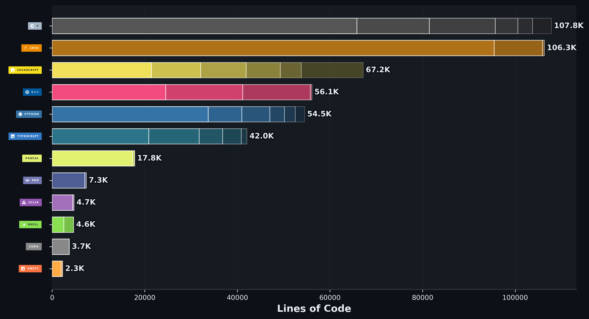

# André Martins

Computer Engineering student interested in algorithms, computational mathematics, and systems-oriented development.

I build mathematical and computational tools across web and CLI environments, often implementing core logic from scratch to better understand performance, numerical behavior, and language design.

---

## 👨‍💻 What I Work On

- Mathematical and statistical tools (web-based and CLI)
- Algorithm implementations (searching, sorting, numerical methods)
- Runtime and performance experiments across languages
- Small systems projects with database integration (SQLite)

Many of my projects are static web applications deployed via GitHub Pages, focusing on clarity, correctness, and practical usability.

---

## 🎯 Approach

I prefer understanding fundamentals over relying purely on abstractions.  
Most projects are built to explore how things work — from mathematical models to runtime behavior.

---

## </> Stack


### Languages:
<div>
  <a href="#">
  
  
  
  
  
  
  
 </a>
</div>

### Other skills:

```json
  {
    "frameworks": ["Bootstrap", "TailwindCSS"],
    "databases": ["SQLite", "Postgres"],
    "oher": ["git", "bash", "docker"],
    "OS": ["Windows", "Linux", "WSL"],
    "IDE": "Visual Studio Code",
    "enviroments": {
      "js": ["Node JS", "npm", "yarn", "Webpack", "Babel"]
    }
  }
```

### Most used languages



